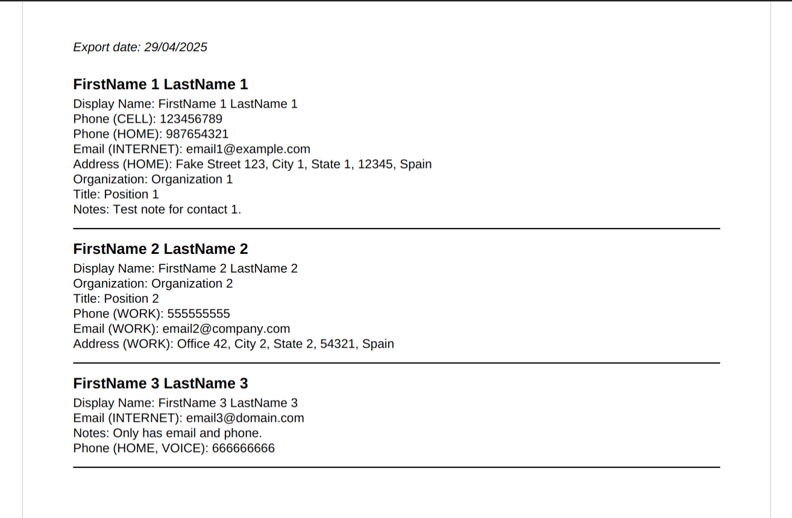

# ContactScribe

ContactScribe is a Python tool that converts exported contact CSVs into clean, organized PDF directories. It highlights names, phone numbers, emails, and other fields, adding separators and an export date. Ideal for printing or backing up your address book in a readable format.

## Features

- **CSV and VCF support**: Handles both CSV and vCard (VCF) files for importing contacts.
- **Multilingual**: Supports English and Spanish translations for field labels.
- **Organized PDF output**: Generates a PDF file with neatly formatted contact information, ready for printing or sharing.
- **Export date**: Automatically adds the current export date to the PDF for reference.
- **Customizable**: Easily extendable to add more fields or change formatting.

## Installation

1. **Clone the repository**:
    ```bash
    git clone https://github.com/yourusername/ContactScribe.git
    cd ContactScribe
    ```

2. **Install dependencies**:
    ```bash
    pip install -r requirements.txt
    ```

## Usage

To use the script, provide a CSV or VCF file as input and optionally specify the language. The script will generate a PDF with the contact information.

### CSV Import Optimization
The CSV import is optimized for CSV files exported from Thunderbird in Spanish. It correctly processes the common fields and formats typically used by Thunderbird's export feature.

### Command-Line Usage

```bash
python ContactScribe.py <path_to_file.csv|vcf> [lang]
```

- `<path_to_file.csv|vcf>`: Path to the input file (CSV or VCF format).
- `[lang]` (optional): Language for the labels in the output PDF. Choose between:
  - `en` (English) — default
  - `es` (Spanish)

#### Example 1: Using a CSV file in English
```bash
python ContactScribe.py contacts.csv
```

#### Example 2: Using a VCF file in Spanish
```bash
python ContactScribe.py contacts.vcf es
```

## Output

The script generates a PDF file with the contact details formatted as follows:




## Contributing

Feel free to contribute to the project! You can:

- Open issues for bug reports or feature requests.
- Fork the repository and submit pull requests with bug fixes or new features.

## License

ContactScribe is released under the MIT License. See [LICENSE](LICENSE) for more information.

## Credits

- **vObject**: Library for parsing VCF files.
- **ReportLab**: Library for generating PDFs.

